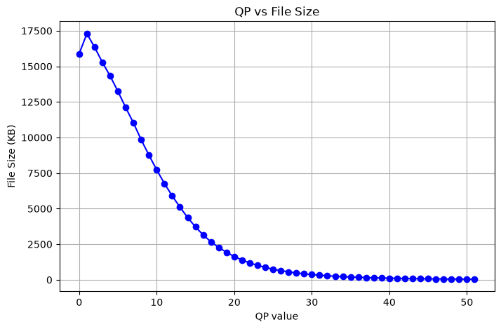
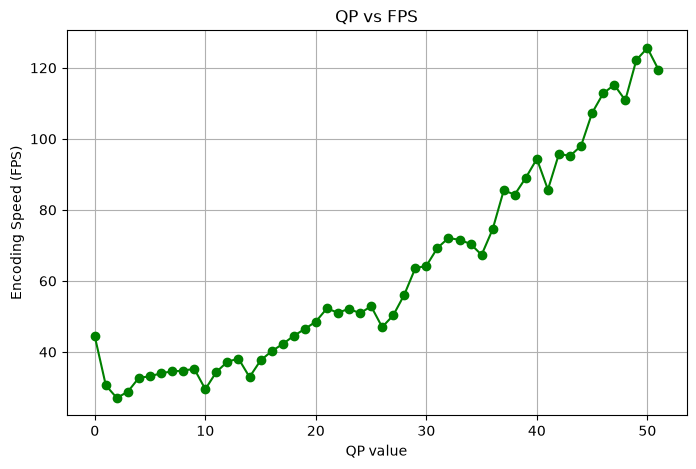

# Beamr_Home_Assignment

## Task 1 – Application Testing (JPEGmini Pro)

The test cases and bug reports for the JPEGmini Pro application are available in [Test_cases_MiniMe.xlsx](jm-test/Test_cases_MiniMe.xlsx).

The file contains the test cases created for the application, including the identified bugs and their details.

## Task 2 – QP Analysis with x264

This script runs x264 encoding on the `foreman-cif.yuv` test video with different QP values and collects results (file size, FPS, bitrate).  
Results are saved in [qp_results.csv](script/qp_results.csv) and visualized in the following graphs:

### QP vs File Size

### QP vs FPS

## Requirements
- Python 3.10+
- matplotlib
- pandas
- xlsxwriter

## How to run
1. Create virtual environment:
   
   python -m venv venv
   

2. Activate venv:
   
    venv\Scripts\activate
    

3. Install dependencies:
    
    pip install -r requirements.txt
    

4. Run analysis:
    
    python qp_analysis.py
  

## Spreadsheet Report
The complete report with charts and conclusions is available in [qp_report.xlsx](script/qp_report.xlsx).
The Excel report contains two sheets: Data (raw results), Charts (visualizations), and Conclusion (summary).

## Notes
- The `venv/` folder is excluded via `.gitignore` and should not be pushed to GitHub.  

## AI Conversation
The full conversation with Copilot is available in [AI_conversation.md](script/AI_conversation.md).

## Additional Task (Optional) – Appium Automation

The Appium automation task is available in the automation folder.

The implementation and explanation of what was tested, what was discovered, and the limitation encountered with the Minime window and WinAppDriver/Appium are described in the [README.md](automation/README.md) file inside the automation folder.